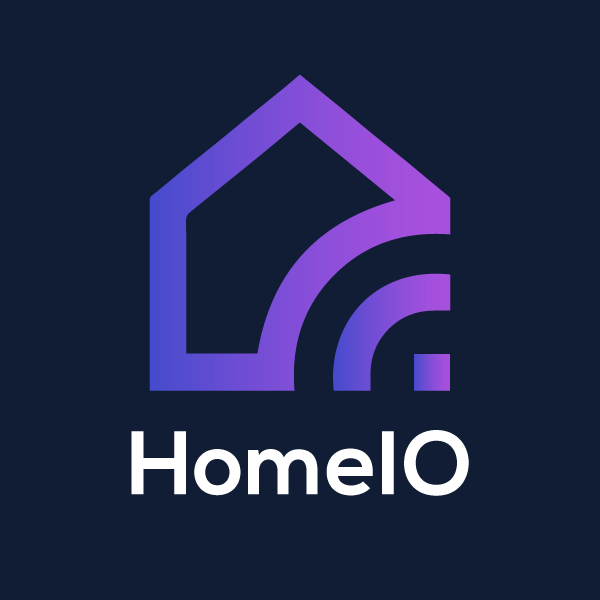

<div style="text-align: center;">
<div>
  
</div>

# HomeIO SmartHub Firmware (Python)

</div>

HomeIO is an all-in-one offline home Automation System with Inbuilt Voice Detection and Power Usage Tracker.

## Features

- [x] Voice Activity Detection
- [x] Speech to Text
- [x] Natural Language Understanding (Intent and Entity Recognition)
- [x] Command Controller
- [ ] Power Usage Tracker

## Setup

**Step 1**: Create a new python environment

```sh
conda create -n homeio python=3.7
conda activate homeio
```

**Step 2**: Install dependancies

```sh
pip install -r requirements.txt
```

**Step 3**: Download Weights using

```sh
sh core/models/get_weights.sh
```

**Step 4**: Run the program

```sh
sh run.sh
```

## Contributing

You are welcome to join the HomeIO Community through applyting to
[Optimus AI](https://lk.linkedin.com/company/teamoptimusai) via sending an email to irugalbandarachandra@gmail.com

Read more about [contributing](public/CONTRIBUTE.md).

## License

[MIT License](public/LICENSE)
